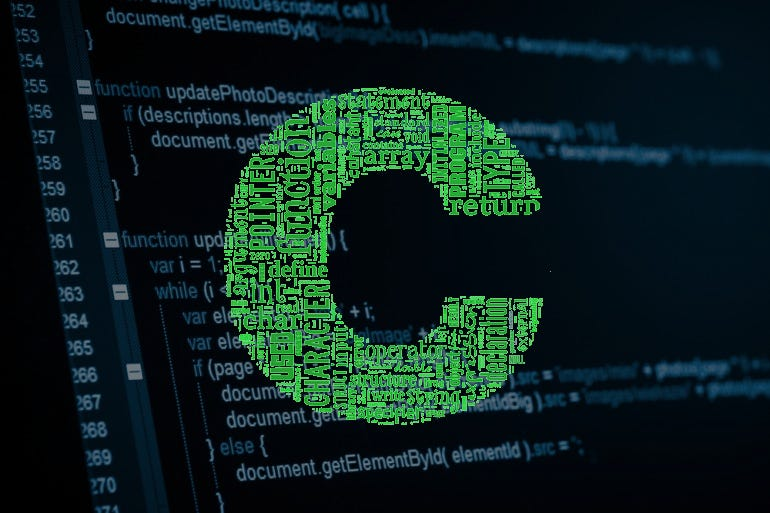

# Janoj Rengaraj

## Table of Contents
[About Me](#about-me)

[Programming-Related](#programming-related)

[Personal-Related](#personal-related)

## About Me

I am a Computer Science Major, 2nd year in in Sixth College. I have lived in **San Diego** for basically my whole life. I enjoy doing a *lot* of different things in my free time.

[Profile](Janoj-Rengaraj.png)

## Programming-Related

### Interests
These are some things I'm interested in that's programming-related:
 - Operating systems
 - machine learning
 - systems programming

### Languages
These are some languages I would like to know:
 - [ ] Python
 - [ ] C++
 - [x] C
 - [x] Java
I've checked the ones that I feel pretty confident in.

Here is some cool C code:
```C
#include <stdio.h>

int main(void) {
    printf("Hello, world!\n");
    return 0;
}
```


## Personal-Related

### Interests
Here are some interests of mine:
1. tennis
2. video games
3. hiking
4. traveling


### Favorite Quote
> Choose to be optimistic, it feels better

Dali Lama

### Cool Link
[Click this](https://zzz.zoomquilt.org/)